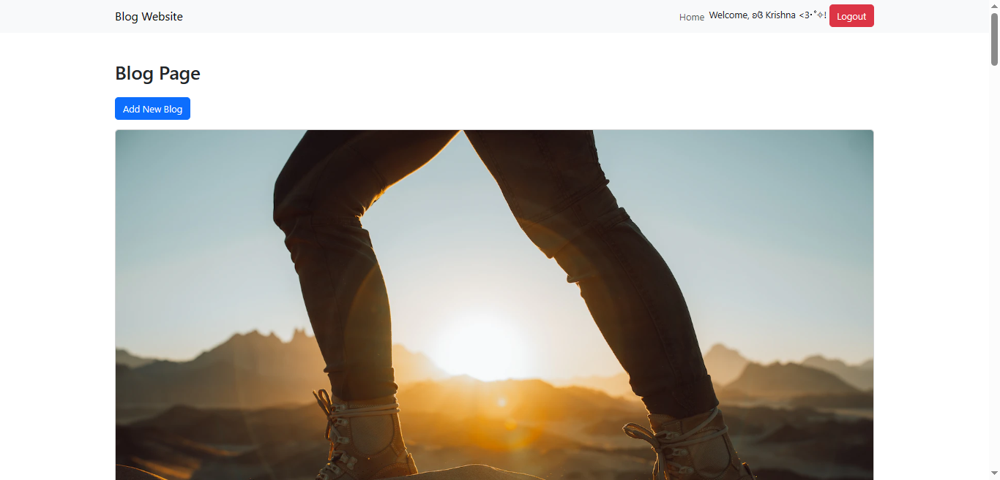
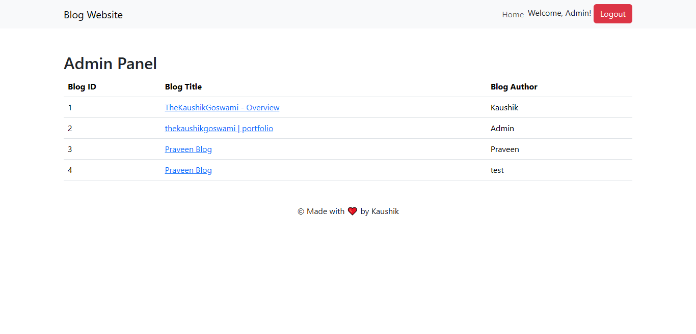

# Anonymous Blog

A simple blogging site with anonymous blog upload & comment features.

> Make sure to ⭐ the Repo if you liked it -- It Helps!

## Introduction

This project is a simple blogging site that allows users to upload blogs anonymously and comment on them. It's designed to be a straightforward platform for sharing thoughts and ideas without leaking their identity, though it does feature an admin login system.

## Screenshot

## Features

- User registration and login functionality.
- Anonymous blog posting.
- Commenting on blogs.
- Admin panel for managing blogs (admin login required).
- Responsive design for a seamless user experience.

## Project Structure

The project follows a standard structure for a PHP-based web application. Here's an overview:

- **`index.php`**: The homepage of the blog website.
- **`register.php`**: User registration page.
- **`login.php`**: User login page.
- **`adminpanel.php`**: Admin panel for managing blogs.
- **`blogs.php`**: Page displaying all blogs.
- **`comments.php`**: Page for viewing and adding comments.
- **`includes/`**: Directory containing header and footer PHP files.
- **`functions/`**: Directory with PHP scripts for specific functionalities (e.g., adding blogs, comments, etc.).
- **`db/`**: Directory containing database configuration and connection files.
- **`css/`**: Directory with the stylesheet (`style.css`).

## Installation

1. Clone the repository to your local machine.
2. Import the database schema (`anon_blog.sql`) into your MySQL database.
3. Configure the database connection in `db/config.php`.
4. Ensure your server environment meets the requirements (PHP, MySQL).
5. Start your local server.

## Usage

1. Access the site through your local server.
2. Register or log in to start blogging.
3. Explore blogs, add comments, and enjoy the anonymous blogging experience.

## Files and Descriptions

Here are key files and their purposes:

- **`index.php`**: Homepage.
- **`register.php`**: User registration page.
- **`login.php`**: User login page.
- **`adminpanel.php`**: Admin panel for managing blogs.
- **`blogs.php`**: Displaying all blogs.
- **`comments.php`**: Viewing and adding comments.
- **`includes/header.php`**: HTML header template.
- **`includes/footer.php`**: HTML footer template.
- **`functions/`**: Directory with PHP scripts for specific functionalities.
- **`db/config.php`**: Database configuration.
- **`db/database.php`**: Database connection script.
- **`css/style.css`**: Stylesheet.

## 📝 License

This project is licensed under the `Apache License 2.0` License. See the [LICENSE](LICENSE) file for details.

Made with ❤ in India
